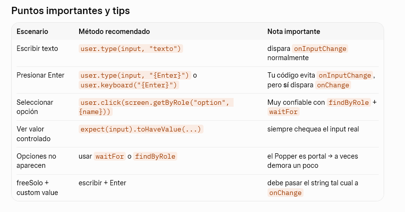
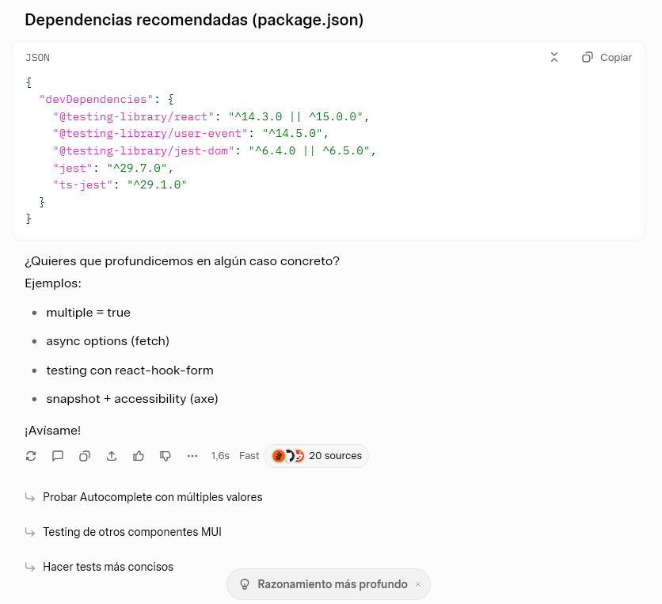

# Comparison movie project

Installation process

# Pre-requisites

---

- Node 22
- Docker
- docker-compose

first install both UI and API projects

- Install dependancies

```bash
docker-compose up
```

```bash
cd UI
npm install
```

```bash
cd api
npm install
```

- Run the projects

```bash
cd UI
npm run dev
```

```bash
cd api
npm run dev
```

These commands will run the project in DEV, the backend dev command can be use,
to be run in prod with the correct .env file. I will be uploading a .env.example
file

To generate a Production build for the UI execute

```bash
cd ui
npm run build
```

The UI also has a .env file that i will be uploading as an example

---

To test the UI please do in the UI directory

```bash
npx playwright install
```

## Front-end selection

On the front-end I selected `TanStack Query` for data-fetching for it's robust
caching mechanisms, and built-in support for loading and error states.
While `zustand` was initially considered for global state managment, further
analysis revealed that a state managment library was unnecesary.

### Front-end Changed requirements

In section 1.1.3 Requirements for Modal to view the result of the search The
`button` to start comparing the current movie selected in the modal, was moved,
from the left column, to the footer of the modal, where it is always available,
clear, and already a well known UX design.

## Backend Selection

The backend selection framework was driven by the project constraints and
development velocity, although I have extensive experience with `Oak` and
`Hono`, they were excluded to maintain a pure JavaScript environment. I opted
for `Fastify` over `Koa` or `Express` to capitalize on its superior performance
while maintaining a familiar architectural pattern. I evaluated `Koa` over
`Fastify`, but the `Sequalize` constraint let me to chose a more familiar
framework over a new library.

Adding test-coverage, pretty reporters can be done, the numbers might be small,
I think is because with my testing strategy we are testing directly with Fastify
and the requests call the testing units.

### Database

The creation of the database is generated by a file, i do not have experience with the `Sequalize` ORM, so i decided to create the DB myself.

## Chart Selection

The MUI charts library was selected mainly, because the project was already
using MUI, and it will keep the same design language, UI in the application

## Formatter

The project has been format with `deno fmt`. but have not formatter installed as a project, i would suggest using `biome` or `prettier`.

## LLM Usage

I do not normally rely on IA to do my code, but sometimes like this is useful to
get some ideas when you are stuck or starting. I think is also useful when you
are stuck on configuration issues.
For testing SearchMovieAutoComplete i asked grok
`como probarias un autocomplete de la libreria MUI con este codigo` in spanish
that roughly translates to,
`How would you test an autocomplete fromthe MUI library with this code` I will
add the whole prompt and response

```javascript
como probarias un autocomplete de la libreria MUI con este codigo
import Autocomplete from "@mui/material/Autocomplete";
import TextField from "@mui/material/TextField";
export default function SearchMovieAutoComplete({
  options,
  value,
  onChange,
  inputValue,
  onInputChange,
}) {
  return (
    <Autocomplete
      freeSolo
      onInputChange={(event, newInputValue) => {
        if (event.code == "Enter") return;
        onInputChange(event, newInputValue);
      }}
      value={value}
      inputValue={inputValue}
      disableCloseOnSelect={true}
      onChange={(event, newValue) => {
        onChange(event, newValue);
      }}
      options={options}
      renderInput={(params) => {
        return (
          <TextField
            {...params}
            label="Search movie"
          />
        );
      }}
    />
  );
}
```

## The response given was:

Para probar bien un componente Autocomplete de MUI (especialmente con freeSolo,
onInputChange y onChange controlados), lo más recomendado hoy en día (2025–2026)
es usar:

React Testing Library (@testing-library/react) user-event v14+
(@testing-library/user-event) jest-dom (para matchers como toHaveValue,
toBeInTheDocument, etc.)

Tu componente es controlado tanto en value como en inputValue, por lo que los
tests deben verificar que:

Las props de control (value, inputValue) se reflejan correctamente Al escribir →
llama a onInputChange Al presionar Enter o seleccionar opción → llama a onChange
El popup se abre/cierra correctamente (opcional, pero útil)

Ejemplo de tests recomendados (SearchMovieAutoComplete.test.tsx)

```javascript
import { render, screen, waitFor } from "@testing-library/react";
import userEvent from "@testing-library/user-event";
import SearchMovieAutoComplete from "./SearchMovieAutoComplete"; // ajusta la ruta

describe("SearchMovieAutoComplete", () => {
  const mockOptions = ["Inception", "Interstellar", "Dune", "Matrix"];

  const defaultProps = {
    options: mockOptions,
    value: null,
    onChange: jest.fn(),
    inputValue: "",
    onInputChange: jest.fn(),
  };

  beforeEach(() => {
    jest.clearAllMocks();
  });

  it("muestra el label correctamente", () => {
    render(<SearchMovieAutoComplete {...defaultProps} />);

    expect(screen.getByLabelText(/search movie/i)).toBeInTheDocument();
  });

  it("refleja inputValue en el campo de texto", () => {
    render(<SearchMovieAutoComplete {...defaultProps} inputValue="Dune par" />);

    const input = screen.getByRole("textbox", { name: /search movie/i });
    expect(input).toHaveValue("Dune par");
  });

  it("llama a onInputChange al escribir (sin Enter)", async () => {
    const user = userEvent.setup();

    render(<SearchMovieAutoComplete {...defaultProps} />);

    const input = screen.getByRole("textbox", { name: /search movie/i });

    await user.type(input, "Inter");

    expect(defaultProps.onInputChange).toHaveBeenCalledTimes(5); // I-n-t-e-r
    expect(defaultProps.onInputChange).toHaveBeenLastCalledWith(
      expect.anything(),
      "Inter",
    );
  });

  it("NO llama a onInputChange cuando se presiona Enter", async () => {
    const user = userEvent.setup();

    render(<SearchMovieAutoComplete {...defaultProps} inputValue="Dune" />);

    const input = screen.getByRole("textbox", { name: /search movie/i });

    await user.type(input, "{Enter}");

    expect(defaultProps.onInputChange).not.toHaveBeenCalled();
    // pero SÍ debería haber llamado a onChange (ver siguiente test)
  });

  it("llama a onChange al presionar Enter con freeSolo", async () => {
    const user = userEvent.setup();

    render(
      <SearchMovieAutoComplete {...defaultProps} inputValue="Blade Runner" />,
    );

    const input = screen.getByRole("textbox", { name: /search movie/i });

    await user.type(input, "{Enter}");

    expect(defaultProps.onChange).toHaveBeenCalledWith(
      expect.anything(),
      "Blade Runner", // ← freeSolo → pasa el string literal
    );
  });

  it("llama a onChange al seleccionar una opción de la lista", async () => {
    const user = userEvent.setup();

    render(<SearchMovieAutoComplete {...defaultProps} />);

    const input = screen.getByRole("textbox", { name: /search movie/i });

    await user.type(input, "du");

    // Esperamos que aparezcan opciones (puede requerir waitFor en algunos casos)
    const option = await screen.findByRole("option", { name: /dune/i });

    await user.click(option);

    expect(defaultProps.onChange).toHaveBeenCalledWith(
      expect.anything(),
      "Dune", // ← valor seleccionado de options
    );
  });

  it("muestra las opciones filtradas al escribir", async () => {
    const user = userEvent.setup();

    render(<SearchMovieAutoComplete {...defaultProps} />);

    await user.type(screen.getByRole("textbox"), "mat");

    await waitFor(() => {
      expect(
        screen.getByRole("option", { name: /matrix/i }),
      ).toBeInTheDocument();
    });

    // No debería aparecer Inception
    expect(
      screen.queryByRole("option", { name: /inception/i }),
    ).not.toBeInTheDocument();
  });
});
```

##  

But I only used, the code example, as the libraries were already selected, and i
only needed ideas of what to test. I copied some of the code like the mocks, and
only changed to be able to be used in vitest.
